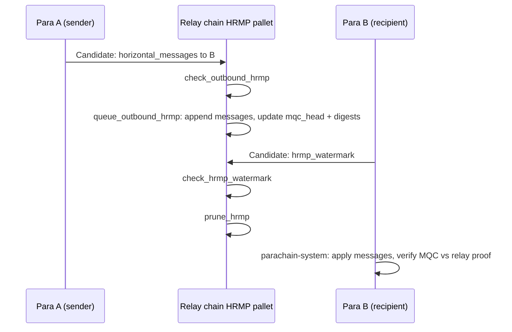

Implementation-oriented notes from the Polkadot SDK: relay pallet `polkadot/runtime/parachains/src/hrmp.rs`, inclusion wiring, and Cumulus `parachain-system`. See also [validate_block and PVF]().

## What HRMP is

**HRMP (Horizontally Relay-routed Message Passing)** lets parachains send bytes to each other using the **same conceptual model as XCMP** (channels, queues), but **full message payloads live in relay-chain storage**. That keeps semantics simpler and makes relay resource use higher. It is described as an interim mechanism until XCMP is fully available.

From the implementers guide (`polkadot/roadmap/implementers-guide/src/messaging.md`):

- Semantically mimics XCMP’s interface.
- **Difference:** all messages are stored on the relay chain.
- Expected to be retired once XCMP is available.

## Data model (relay chain)

**Main implementation:** `polkadot/runtime/parachains/src/hrmp.rs`

- **`HrmpChannelId`**: `(sender, recipient)` — **unidirectional**; `(A,B)` and `(B,A)` are different channels.
- **`HrmpChannel`**: negotiated `max_capacity`, `max_total_size`, `max_message_size`; current `msg_count`, `total_size`; **`mqc_head`** (message-queue chain hash for light-client / para verification).

**Important storage:**

| Storage | Role |
|--------|------|
| `HrmpChannels` | Per-channel metadata + MQC head |
| `HrmpChannelContents` | Queued `InboundHrmpMessage` per channel |
| `HrmpChannelDigests` | Per recipient: relay block numbers where inbound HRMP arrived (watermark rules) |
| `HrmpWatermarks` | Last relay block the recipient committed to having processed up to |
| `HrmpOpenChannelRequests*` / `HrmpCloseChannelRequests*` | Handshake + teardown |
| `HrmpIngressChannelsIndex` / `HrmpEgressChannelsIndex` | Neighbor index per para |

**Message types** (from `types/messages.md`):

- **`OutboundHrmpMessage`**: `recipient`, `data` — in a **sender** candidate’s commitments.
- **`InboundHrmpMessage`**: `sent_at` (relay block when the sending candidate was enacted), `data` — what gets **stored** on the relay chain for the recipient.

## Channel lifecycle

1. **Open:** sender `hrmp_init_open_channel`, recipient `hrmp_accept_open_channel` (parachain origin).
2. **Activate / close on session change:** `initializer_on_new_session` runs `process_hrmp_open_channel_requests`, `process_hrmp_close_channel_requests`, and cleanup for outgoing paras (`polkadot/runtime/parachains/src/initializer.rs` → HRMP).

## Per-block flow: candidate → relay state

In `inclusion::enact_candidate` (`polkadot/runtime/parachains/src/inclusion/mod.rs`):

1. **`prune_hrmp(recipient_para, hrmp_watermark)`** — recipient candidate says it processed inbound HRMP up to that relay block; relay drops stored messages with `sent_at` ≤ watermark and updates digests / watermark.
2. **`queue_outbound_hrmp(sender_para, horizontal_messages)`** — appends `InboundHrmpMessage { sent_at: current_block, data }` to `HrmpChannelContents`, updates channel counts, **MQC head**, and recipient **digest** for that block.

## Acceptance checks (invalid candidates fail before enact)

`check_validation_outputs` calls:

- **`check_hrmp_watermark`** — watermark not ahead of relay parent; monotonic vs last stored watermark (with exception when watermark equals relay parent); if moving backward in relay history, target block must appear in **`HrmpChannelDigests`** (“lands on a block with messages”).
- **`check_outbound_hrmp`** — global per-candidate limit; messages **strictly sorted by recipient**; channel must exist; per-message size and cumulative **capacity / total size** vs. channel state at relay parent.

## Parachain side (Cumulus)

`cumulus/pallets/parachain-system`: **`enqueue_inbound_horizontal_messages`**

- Validates ordering and open channels.
- Rebuilds local **MQC** and **`check_hrmp_mcq_heads`** against abridged channel data from the relay proof.
- Dispatches XCM via `XcmpMessageHandler`.
- Updates para-local **`HrmpWatermark`**.

## Relay `inclusion`: both roles per included para

For **each** enacted candidate, the relay runs **both**:

- **`prune_hrmp`** — this para as **receiver** (watermark / inbound processed).
- **`queue_outbound_hrmp`** — this para as **sender** (`horizontal_messages`).

So inclusion is **not** “sender-only” or “receiver-only”; it applies **both** effects for the **same** `para_id` in one inclusion.

## Sending OUT → `horizontal_messages` → relay storage

How outbound bytes become **`CandidateCommitments.horizontal_messages`** and then HRMP queues on the relay.

### 1. Source of payloads on the parachain

Outbound HRMP is **opaque bytes** to the relay. In typical runtimes they come from **XCMP / XCM egress** buffered in **`pallet-xcmp-queue`**, wired as **`type OutboundXcmpMessageSource = XcmpQueue`**.

Trait (`cumulus/primitives/core/src/lib.rs`): **`XcmpMessageSource::take_outbound_messages(maximum_channels) -> Vec<(ParaId, Vec<u8>)>`** — up to `N` messages as **(recipient para, payload)**.

`XcmpQueue::take_outbound_messages` drains **`OutboundXcmpMessages`** per recipient and respects **`ChannelInfo`** (channel closed / full / ready).

### 2. `parachain-system` `on_finalize`: XCMP queue → `HrmpOutboundMessages`

At **`on_finalize`**, after the block body has executed (XCM may have enqueued outbound messages):

- Compute how many outbound HRMP messages are still allowed this **PoV**: relay **`hrmp_max_message_num_per_candidate`**, **`AnnouncedHrmpMessagesPerCandidate`**, and **`PoVMessagesTracker`** (multi-block / async-backing segment budgets).
- Call **`T::OutboundXcmpMessageSource::take_outbound_messages(...)`**.
- Map **`(recipient, data)` → `OutboundHrmpMessage { recipient, data }`**.
- **`HrmpOutboundMessages::put(outbound_messages)`**.

Constraints enforced in code comments: channel must exist; **at most one message per channel** in that send batch; **strictly ascending `recipient` `ParaId`**; capacity / size limits via **`RelevantMessagingState`** / **`GetChannelInfo`**.

**`collect_collation_info`** (runtime API used when building collations) exposes the same **`horizontal_messages: HrmpOutboundMessages::get()`** plus **`hrmp_watermark`**, UMP, DMP counts, etc.

### 3. `validate_block`: storage → `ValidationResult.horizontal_messages`

Validators **re-execute** the block; they do not trust the collator’s commitments blindly.

After **`execute_verified_block`**, `validate_block/implementation.rs` reads parachain-system storage and builds **`ValidationResult`**, including:

- **`horizontal_messages`** ← **`HrmpOutboundMessages::get()`** (accumulated if multiple blocks in one PoV).
- **`hrmp_watermark`**, **`processed_downward_messages`**, **`upward_messages`**, head data, optional code upgrade.

That result is what becomes **`CandidateCommitments`** (hashed with the rest). Backing validators run the same PVF / `validate_block`; mismatched **`horizontal_messages`** ⇒ invalid candidate.

The reads run under **`run_with_externalities_and_recorder`**: production PVF code sets Substrate externalities over the PoV-backed trie + overlay so pallet storage reads see the state after block execution — not test-only.

### 4. Relay inclusion

- **`check_validation_outputs` → `check_outbound_hrmp`**: second line of defense vs relay-parent state (count limit, sorted recipients, channel exists, per-msg size, channel capacity / total bytes).
- **`enact_candidate` → `queue_outbound_hrmp`**: append **`InboundHrmpMessage { sent_at: enactment block, data }`** into **`HrmpChannelContents`**, update **MQC head**, **digests**, channel **`msg_count` / `total_size`**.

### One-liner

**App logic enqueues XCMP egress → `on_finalize` drains into `HrmpOutboundMessages` → `validate_block` copies that into commitments’ `horizontal_messages` → relay checks and `queue_outbound_hrmp` writes relay HRMP storage for recipients.**

**Deeper follow-up:** `cumulus/pallets/xcmp-queue/src/lib.rs` — **`take_outbound_messages`** (signals vs data pages, closed channels swallowing pages).

## End-to-end sequence

## Files to read

| Topic | Path |
|------|------|
| Relay pallet | `polkadot/runtime/parachains/src/hrmp.rs` |
| Inclusion | `polkadot/runtime/parachains/src/inclusion/mod.rs` |
| Session hooks | `polkadot/runtime/parachains/src/initializer.rs` |
| Para ingest + outbound finalize | `cumulus/pallets/parachain-system/src/lib.rs` (`on_finalize`, `collect_collation_info`) |
| `validate_block` / commitments | `cumulus/pallets/parachain-system/src/validate_block/implementation.rs` |
| XCMP egress queue | `cumulus/pallets/xcmp-queue/src/lib.rs` (`take_outbound_messages`) |
| `XcmpMessageSource` trait | `cumulus/primitives/core/src/lib.rs` |
| Concepts | `polkadot/roadmap/implementers-guide/src/messaging.md`, `types/messages.md` |
| `register_validate_block!` macro | `cumulus/pallets/parachain-system/proc-macro/src/lib.rs` |

## `validate_block` / PVF — relay validators vs relay runtime

**`cumulus/pallets/parachain-system/src/validate_block/implementation.rs`** is the main body of **parachain block validation** for Cumulus: build a trie from the PoV **storage proof**, replace storage **host calls** so execution stays inside the validation artifact, **execute the block**, return **`ValidationResult`**. `run_with_externalities_and_recorder` is **not** test-only — it is how executed state is read back after `execute_verified_block`.

### Relationship to the PVF

- Each parachain runtime uses **`register_validate_block!`**, which in `no_std` emits a **`#[no_mangle] fn validate_block(...)`** export — the entry point of the parachain **validation function** (PVF) the relay chain stores.
- **`implementation.rs`** is compiled **into that parachain runtime Wasm** (PVF), not into the Polkadot relay **`frame_executive`** runtime.

### “Run on validators” — precise wording

| Correct | Misleading |
|--------|------------|
| **Relay validators** (Polkadot node, PVF / candidate-validation worker) **execute** this Wasm in an **isolated VM** (e.g. Wasmtime; PolkaVM where applicable). | It runs as **on-chain relay-chain logic** (relay pallets executing inside a relay block). |

So: **same network and security model as the relay chain**, but PVF execution is **off-chain validation work** on the node, not a relay extrinsic.

**One-liner:** `implementation.rs` **is** the validate-block logic inside the **PVF**; validators **run it** when checking parachain candidates; it is **not** part of relay-chain state transitions, **is** part of **parachain candidate validation**.
