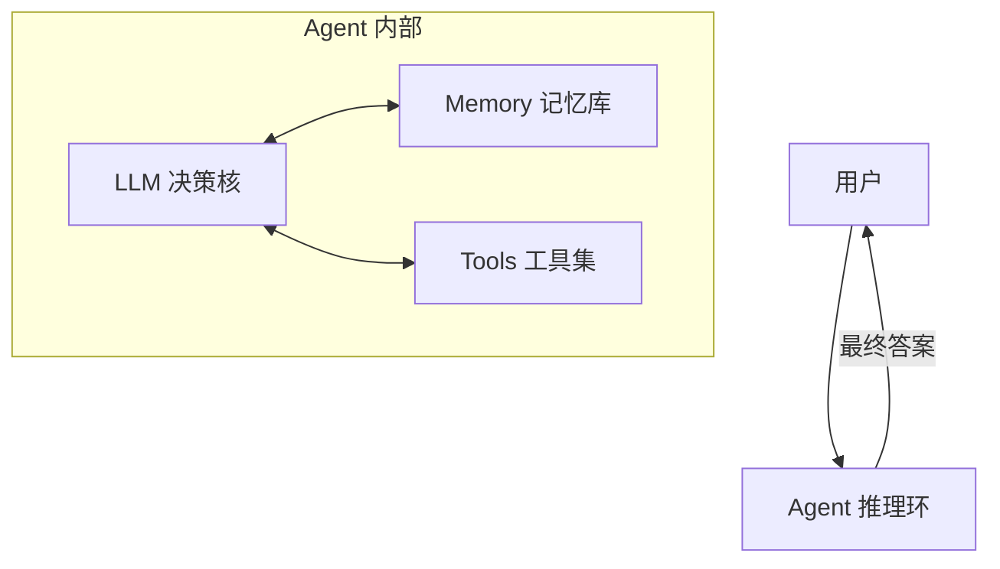
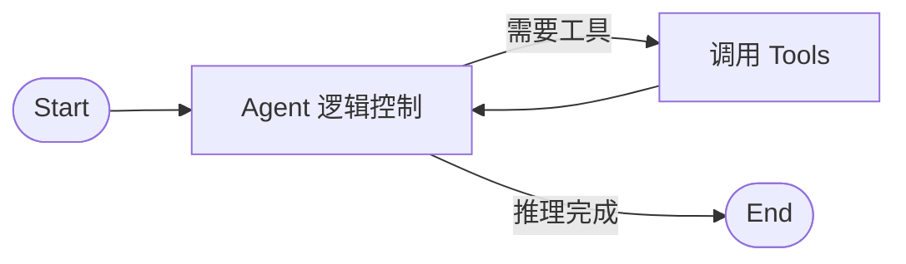

本篇笔记基于 TensorOps 机器学习工程师 Clara Gadelho 的视频教程 [How to Create Your Own AI Agent - Tutorial with Clara Gadelho](https://www.youtube.com/watch?v=6Dvj4VZsscg) 整理，详细记录了如何基于现代 LLM 框架构建一个具备工具调用和记忆能力的 ReAct 智能体（旅行助理）。

<!--more-->

---

## 一、 AI Agent 与 ReAct 架构基础

在现代大语言模型应用中，**Agent（智能体）** 是能够自主决策、调用外部工具并执行复杂任务的实体。

### 1. ReAct (Reasoning and Acting) 架构
ReAct 是构建 Agent 最主流的架构之一。它的核心思想是**交替进行“思考”与“行动”**：
1.  **Reasoning（推理）**：模型根据用户的输入进行思考，分析当前状态，并决定下一步需要做什么。
2.  **Acting（行动）**：如果需要外部信息，模型会调用指定的 **Tools（工具）**（如搜索引擎、API、计算器）。
3.  模型将工具返回的结果与此前的推理结合，继续进行下一步推理，直至得到最终答案返回给用户。



### 2. 构建 Agent 的三大核心要素
*   **Tools（工具）**：Agent 与外界交互的桥梁，可以是 API、数据库查询或任意 Python 函数。
*   **Memory（记忆）**：使 Agent 能够记住上下文及历史多轮对话信息。
*   **Planning（规划）**：控制推理的环路及图流向。

---

## 二、 技术选型

本教程使用了两个核心库：
*   **LLM Studio**：TensorOps 开源的模型路由与管理库。它作为大模型的统一网关，允许开发者在无需修改业务代码的前提下，轻松在 GPT-4o、Gemini 等不同模型之间进行无缝切换。
*   **LangGraph**：由 LangChain 团队开发的基于图（Graph）的 Agent 构建框架。它高度模块化，提供开箱即用的状态管理和循环控制能力，极大简化了复杂 Agent 架构（如多 Agent 协同）的开发。

---

## 三、 实战：构建一个智能旅行助手

### 1. 前置准备
在运行代码前，需要安装依赖并配置环境变量：
*   **环境依赖**：Python 3.10+，安装 `langchain`、`langgraph`、`requests`、`python-dotenv` 和 `llm-studio`。
*   **API 密钥**：
    *   模型提供商 API 密钥（如 OpenAI Key）。
    *   **Weatherbit API** Key：用于查询目的地的实时天气。
    *   **Tavily Search API** Key：用于实现高性能的网页搜索。

### 2. 核心代码实现步骤

#### 步骤 1：导入依赖与初始化 LLM
使用 `llm-studio` 作为路由器连接 OpenAI 的 `gpt-4o` 模型，并将其包装为可被 LangChain 兼容调用的接口。

```python
import os
import sys
from dotenv import load_dotenv
from llm_studio import LLM  # 导入 LLM Studio

load_dotenv()

# 初始化大语言模型路由器
llm = LLM(provider="openai")
model = llm.get_model("gpt-4o")
```

#### 步骤 2：定义 Agent 工具 (Tools)
为了完成旅行规划，我们为 Agent 装备了三种工具：
1.  **获取系统当前时间**：让 Agent 知晓“今天”的日期，以便推算预订时间。
2.  **网络搜索工具**：使用预置的 `TavilySearchResults`。
3.  **获取天气工具**：调用外部 Weatherbit API 接口。

> **重要提示**：在编写自定义工具时，必须为函数添加详细的 **Docstring（文档字符串）**。Agent 在运行时会读取 Docstring 来判断该工具的作用以及何时去调用它。

```python
from langchain_core.tools import tool
from langchain_community.tools.tavily_search import TavilySearchResults
from datetime import datetime

# 1. 自定义获取当前时间的工具
@tool
def get_system_date() -> str:
    """Get the current system date. Useful for calculating relative travel dates."""
    current_date = datetime.now().strftime("%Y-%m-%d")
    return f"The current date is: {current_date}"

# 2. 初始化网络搜索工具（限制返回 3 条结果以防超长）
web_search_tool = TavilySearchResults(max_results=3)

# 3. 自定义天气查询工具（调用外部 Weatherbit API）
@tool
def get_weather(location: str) -> str:
    """Fetch the weather forecast for a given location."""
    # （此处省略具体的 HTTP 请求解析代码）
    return f"Weather forecast for {location}: Sunny, 25°C."
    
tools = [get_system_date, web_search_tool, get_weather]
```

#### 步骤 3：构建 ReAct Agent 与会话记忆
使用 LangGraph 的 `create_react_agent` 快速装配。通过引入 `MemorySaver` 来持久化对话状态，允许 Agent 在多轮对话中通过 `thread_id` 自动找回历史记忆。

```python
from langgraph.prebuilt import create_react_agent
from langgraph.checkpoint.memory import MemorySaver

# 定义 Agent 系统级提示词（State Modifier）
system_prompt = (
    "You are a helpful travel assistant. If given a duration for a trip, "
    "suggest a detailed daily itinerary with activities, meals, and accommodations. "
    "Include weather forecasts in your decisions and search the web for real-time flights or hotels. "
    "Make sure to provide direct links if you suggest booking."
)

# 实例化会话记忆组件
memory = MemorySaver()

# 构建 Agent 流程图
agent = create_react_agent(
    model=model,
    tools=tools,
    state_modifier=system_prompt,
    checkpointer=memory
)
```

#### 步骤 4：可视化图结构
LangGraph 允许直接生成 Mermaid 架构图，其拓扑结构非常直观：


---

## 四、 运行与多轮对话测试

### 1. 首轮提问：规划行程
配置会话 `thread_id` 为 `1`，输入任务需求：“帮我规划两周后去米兰的 3 天行程，我从波尔图出发。”

```python
config = {"configurable": {"thread_id": "1"}}
inputs = {"messages": [("user", "Plan a 3-day trip to Milan that will happen in two weeks. I'm traveling from Porto.")]}

for event in agent.stream(inputs, config):
    # 打印运行中的事件与消息流
    pass
```

*   **运行轨迹**：
    1.  Agent 自动触发 `get_system_date` 获取今天日期，算出两周后的精确出行时间。
    2.  调用 `get_weather("Milan")` 查询届时的天气。
    3.  调用 `Tavily` 搜索从波尔图飞往米兰的航班以及酒店价格信息。
    4.  最后，结合所有数据生成带有预订链接的精细化 3 天行程单。

### 2. 第二轮提问：测试会话记忆
紧接着在同一个 `thread_id` 下提问：“我去的时候那里的圣诞集市开了吗？”（**注意：此提问中没有提到“米兰”以及出行时间**）。

```python
inputs_2 = {"messages": [("user", "Will Christmas markets be open when I go there?")]}

for event in agent.stream(inputs_2, config):
    pass
```

*   **结果**：Agent 成功从 Memory 中检索出之前的目的地为“米兰”，并且出发时间是两周后。它利用这些信息再次自动联网搜索当年米兰圣诞集市的开放时间，并给出了准确的答复。

---

## 五、 总结与启发

本教程展示了如何使用极少的代码搭建一个生产级别的 Agent 原型：
1.  **极简构建**：LangGraph 的 `create_react_agent` 屏蔽了底层图状态维护的复杂细节，使得快速验证思路变得非常简单。
2.  **Docstring 即代码**：在 Tool 设计中，Python 函数的 Docstring 直接被充当了大模型的系统提示词，决定了模型的调用时机，凸显了“Prompt Engineering”在 Agent 时代的重要性。
3.  **大模型网关的作用**：配合 `llm-studio`，可以大幅度降低大模型升级换代时的适配成本。
