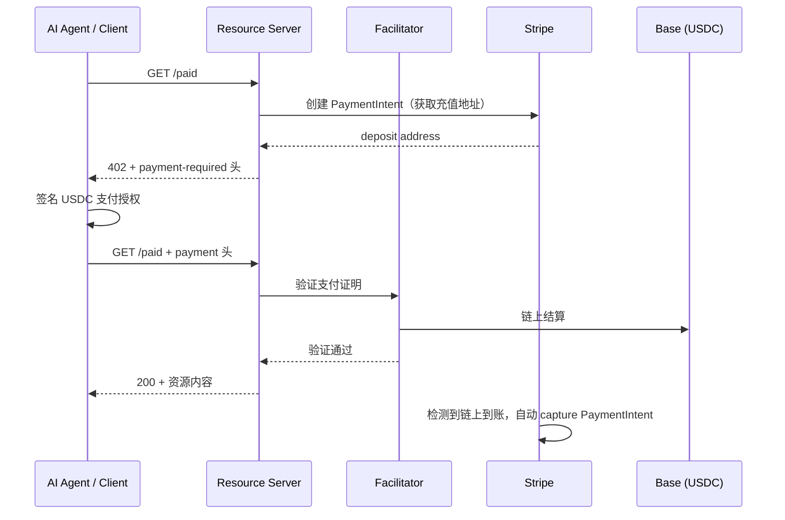
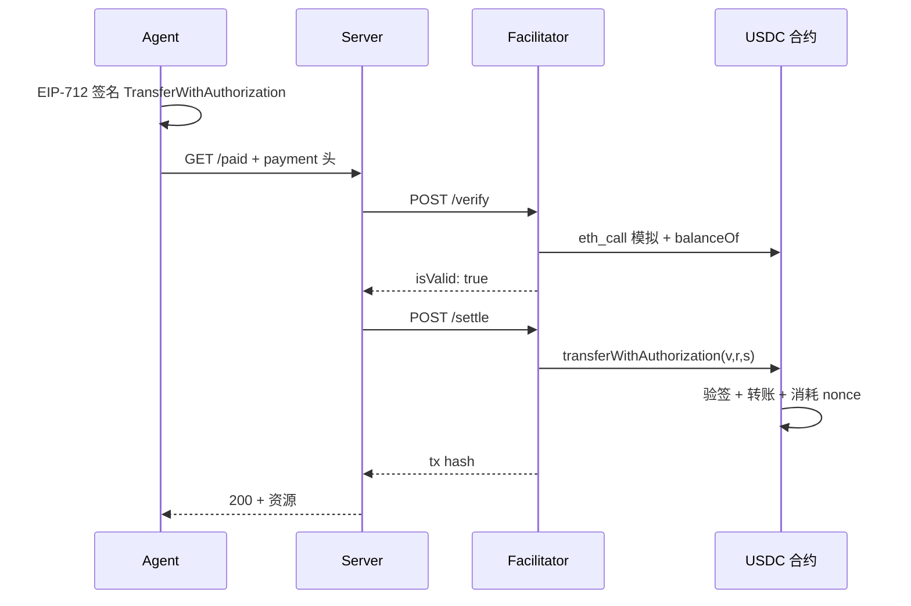

x402 是一种面向机器对机器（M2M）支付的开放协议，核心思路是**复活 HTTP 402「Payment Required」状态码**，让 API 在返回付费要求时，客户端（尤其是 AI Agent）能自动完成支付并重试请求，无需人工介入、无需预先注册账号。

Stripe 在 2026 年将其接入现有支付基础设施：开发者仍用熟悉的 PaymentIntent 和 Dashboard，底层走 USDC 链上结算；Coinbase 则围绕同一协议构建了 Agent.market 代理经济生态。本文综合 BitKan 解读、[Stripe 官方文档](https://docs.stripe.com/payments/machine/x402) 与示例代码，整理一份学习笔记。

<!--more-->

## 1. 背景：为什么需要 x402？

传统 API 付费模式对 AI Agent 极不友好：

| 模式 | 问题 |
|------|------|
| API Key + 订阅 | Agent 需预先注册、绑定信用卡，无法按次按需付费 |
| OAuth / 账号体系 | 人类身份验证流程，Agent 难以自动化 |
| 链上直接转账 | 每笔交易需单独签名、确认，延迟高、集成复杂 |

x402 把「付费」嵌入 HTTP 请求本身：服务端返回 402 + 支付条件，客户端签名授权后带 `payment` 头重试，**一次 HTTP 往返完成议价与结算**。这对 $0.01 级别的微支付、7×24 运行的自主 Agent 尤为合适。

协议最初由 Coinbase 在 2025 年开源，x402 Foundation（Coinbase + Cloudflare 共同发起）维护规范；Stripe、Google、Cloudflare 等均已接入或提供兼容实现。

## 2. 支付流程



关键角色：

- **Resource Server**：你的 API，声明哪些路由需要付费、价格多少、收款地址。
- **Facilitator**：验证支付签名、执行链上结算的第三方服务（测试可用 x402.org testnet facilitator；主网可用 [Coinbase CDP Facilitator](https://docs.cdp.coinbase.com)）。
- **Stripe**：管理充值地址生命周期、PaymentIntent 状态、Dashboard 对账与合规。

未付款时，服务端返回：

```http
HTTP/1.1 402 Payment Required
payment-required: eyJ4NDAyVmVyc2lvbiI6MiwiZXJyb3IiO...
```

`payment-required` 头是 base64 编码的 JSON，包含金额、网络、收款地址、scheme 等信息。

## 3. Facilitator：验签与链上结算

**Facilitator**（协调者）是 x402 协议中的第三方服务，负责**验证客户端的支付证明**，并在通过后**执行链上结算**。Resource Server 不必自己跑全节点、验签名、发交易，而是通过 `HTTPFacilitatorClient` 把链上操作委托给 Facilitator。

### 3.1 在架构中的位置

| 角色 | 职责 |
|------|------|
| **Resource Server** | 声明价格、返回 402、保护付费路由 |
| **Facilitator** | 验签、链上结算、向 Server 背书「支付有效」 |
| **Stripe**（可选） | 生成充值地址、监听到账、capture PaymentIntent、Dashboard 对账 |

Facilitator 管的是**协议层链上结算**；Stripe 管的是**商户收款侧认账**。两者分工不同，在 Stripe x402 集成里通常同时使用。

常见 Facilitator：测试网用 x402.org testnet facilitator；主网可用 [Coinbase CDP Facilitator](https://docs.cdp.coinbase.com)（`https://api.cdp.coinbase.com/platform/v2/x402`）。协议开放，也可自建。

### 3.2 密码学基础：EIP-3009 + EIP-712

Facilitator 的验签与结算建立在 USDC 的 **EIP-3009（TransferWithAuthorization）** 和 **EIP-712（结构化数据签名）** 上：

- Agent **只签名授权，不自己发链上交易**，也**不需要持有 ETH 付 gas**
- Facilitator 验签通过后，代付 gas 调用 USDC 合约完成转账

收到 402 后，Agent 钱包对 `TransferWithAuthorization` 做 EIP-712 签名，授权内容示例：

```json
{
  "from": "0xAgentWallet...",
  "to": "0xDepositAddress...",
  "value": "10000",
  "validAfter": "1740672089",
  "validBefore": "1740672154",
  "nonce": "0xf3746613..."
}
```

签名时附带 **domain separator**（合约地址、chainId、代币名 `"USD Coin"` 等），防止签名被挪到其他链/合约复用。结果 base64 编码后放入 HTTP `payment` 头，重试请求。

### 3.3 两个标准 API：`/verify` 与 `/settle`

[x402 规范](https://github.com/coinbase/x402/blob/main/specs/x402-specification-v2.md) 定义了 Facilitator 的标准 HTTP 接口，`x402ResourceServer` 通过 `HTTPFacilitatorClient` 调用：

| 端点 | 作用 |
|------|------|
| `POST /verify` | 验签 + 预检，**不上链** |
| `POST /settle` | 验签通过后，**广播链上交易** |
| `GET /supported` | 返回支持的 scheme、网络列表 |

Server 将 `payment` 头解码后的 payload 与原始 `paymentRequirements`（402 里声明的金额、地址、网络）一并发给 Facilitator。

#### `/verify` 检查项（exact scheme / EVM）

依据 [scheme_exact_evm 规范](https://github.com/x402-foundation/x402/blob/main/specs/schemes/exact/scheme_exact_evm.md)：

1. `ecrecover` 恢复签名者 → 必须等于 `authorization.from`
2. 链上 `balanceOf(from)` → 余额 ≥ `value`
3. `authorization.value` == `paymentRequirements.amount`（精确金额）
4. `authorization.to` == `paymentRequirements.payTo`
5. 当前时间在 `[validAfter, validBefore]` 窗口内
6. `nonce` 未被使用过（防重放）
7. token 合约地址、network 与要求一致
8. `eth_call` 模拟 `transferWithAuthorization(...)` → 必须成功

通过返回 `{ "isValid": true, "payer": "0x..." }`；失败返回 `invalid_signature`、`insufficient_funds`、`nonce_already_used` 等。

#### `/settle` 链上执行

Facilitator 用自己的钱包（持有 ETH 作 gas）调用 USDC 合约：

```solidity
USDC.transferWithAuthorization(
    from, to, value,
    validAfter, validBefore, nonce,
    v, r, s   // 从 payload.signature 拆出
);
```

合约内部再次验签、检查 nonce、执行 `transfer(from → to, value)` 并标记 nonce 已消费。确认后返回交易哈希。



`paymentMiddleware` 将 verify/settle 封装在请求处理流程中，开发者通常不直接调用这两个 API。

### 3.4 安全性质

规范明确：**Facilitator 不能修改金额或收款地址**，它仅是交易广播员，替 Agent 付 gas。签名里 `to` 和 `value` 已固定，合约只按签名执行。

| 机制 | 防什么 |
|------|--------|
| EIP-712 domain（chainId + 合约地址） | 跨链/跨合约重放签名 |
| 一次性 nonce | 同一授权付两次 |
| `validBefore` 时间窗 | 过期授权被滥用 |
| exact scheme | 金额必须精确匹配 |
| `eth_call` 模拟 | 避免广播必失败的交易 |

在 Stripe 集成中：Facilitator 完成 Agent → Stripe 充值地址的 USDC 链上转账；Stripe 监听该地址到账并 capture 对应 PaymentIntent。

## 4. Stripe 的实现要点

### 4.1 与开放协议的关系

需要区分两个概念：

- **x402 协议**：开放的 HTTP 402 握手规范，Apache 2.0，不绑定厂商。
- **Stripe Machine Payments**：Stripe 提供的托管层，负责充值地址、链上监控、PaymentIntent capture、退款与 Dashboard 报表。

Stripe 还另有 **MPP（Machine Payments Protocol）**——基于会话的流式支付，适合高频连续扣费；x402 则是**按请求精确付费**（exact scheme）。两者可并存，按场景选型。

### 4.2 为什么要创建 PaymentIntent？

流程图里「Server → Stripe: 创建 PaymentIntent」这一步容易让人困惑：x402 协议本身只要求 402 响应里带上金额和收款地址，为什么不能直接写死一个钱包地址？

**核心原因：Stripe 需要把链上 USDC 转账映射成一笔可追踪的 Stripe 订单。**

纯 x402（Coinbase 原生路径）可以配置静态 `payTo: "0xYourWallet"`，由 Facilitator 验证签名和链上结算，不经过任何支付网关。但一旦接入 Stripe，**PaymentIntent + deposit address** 就是它的集成方式——多这一步，换来 Dashboard 对账、自动 capture 和退款能力。

#### 动态生成专属充值地址

`paymentIntents.create` 返回的 `deposit_addresses.base.address` 是 Stripe 为**这一笔** PaymentIntent 专门分配的地址，不是商户的固定收款钱包。Agent 往这个地址打 USDC 后，Stripe 监听链上到账并自动 **capture** 对应 PI，资金进入 Stripe 余额。

#### 纳入 Stripe 账务体系

| 无 PaymentIntent | 有 PaymentIntent |
|----------------|------------------|
| Agent 往某地址打 USDC | Agent 往 Stripe 分配的地址打 USDC |
| 自行扫链、对账 | Stripe 自动检测到账并 capture |
| 无 Dashboard 记录 | Payments 页面可见 |
| 退款需自建 | 可走 Stripe 退款流程 |

PaymentIntent 的 `amount` 还绑定了期望收款金额，Stripe 到账检测时会校验该地址应收多少 USDC，避免少付、多付混乱。

#### 防止伪造收款地址

`createPayToAddress` 在客户端重试时从 `payment` 头解码 `authorization.to`，并与服务端缓存比对——只有**本服务器最近通过 Stripe 创建过 PI 的地址**才合法，攻击者无法把随机地址塞进 payment 头骗过验证。

#### 与纯 x402 的对比

```
纯 Coinbase x402:  payTo = 静态钱包 → Facilitator 验证 → 完成
Stripe x402:       payTo = PI 动态地址 → Facilitator 验证 → Stripe capture PI → 完成
```

一句话：**402 响应里的 `payTo` 不是随便写的钱包，而是 Stripe 说「往这个地址打钱，我会认账」。**

### 4.3 技术栈

| 组件 | 作用 |
|------|------|
| `@x402/hono` / `@x402/express` | 框架中间件，拦截路由、返回 402、校验 payment 头 |
| `@x402/core/server` | `HTTPFacilitatorClient`、`x402ResourceServer` |
| `@x402/evm/exact/server` | EVM 链「精确金额」支付 scheme |
| Stripe SDK `2026-03-04.preview` | 创建 crypto PaymentIntent，获取充值地址 |

### 4.4 `createPayToAddress`：动态收款地址

Stripe 模式下，`payTo` 不是写死的钱包地址，而是一个**异步函数**：

1. **首次请求**：调用 `stripe.paymentIntents.create`，`payment_method_types: ["crypto"]`，`mode: "deposit"`，指定 `networks: ["base"]`；从 `next_action.crypto_display_details.deposit_addresses.base.address` 取出充值地址。
2. **重试/验证请求**：从 `payment` 头解码出 `authorization.to`，与缓存中的地址比对，防止伪造收款方。
3. **缓存**：示例用 `node-cache`（TTL 5 分钟）；生产环境应换 Redis 等分布式缓存。

```typescript
const paymentIntent = await stripe.paymentIntents.create({
  amount: amountInCents,
  currency: "usd",
  payment_method_types: ["crypto"],
  payment_method_data: { type: "crypto" },
  payment_method_options: {
    crypto: {
      mode: "deposit",
      deposit_options: { networks: ["base"] },
    },
  },
  confirm: true,
});
```

链上到账后，Stripe 自动 capture 对应 PaymentIntent，资金进入 Stripe 余额。

### 4.5 中间件配置

```typescript
app.use(
  paymentMiddleware(
    {
      "GET /paid": {
        accepts: [{
          scheme: "exact",           // 精确金额
          price: "$0.01",            // 每次请求 $0.01
          network: "eip155:84532",   // Base Sepolia 测试网
          payTo: createPayToAddress, // 动态地址
        }],
        description: "Data retrieval endpoint",
        mimeType: "application/json",
      },
    },
    new x402ResourceServer(facilitatorClient).register(
      "eip155:84532",
      new ExactEvmScheme(),
    ),
  ),
);
```

网络标识使用 [CAIP-2](https://github.com/ChainAgnostic/CAIPs/blob/master/CAIPs/caip-2.md) 格式：`eip155:84532`（Base Sepolia）、`eip155:8453`（Base 主网）。

### 4.6 支持的网络与代币

Stripe crypto PaymentIntent（deposit 模式）当前支持：

| 网络 | 代币 | 合约地址 |
|------|------|----------|
| Base | USDC | `0x833589fCD6eDb6E08f4c7C32D4f71b54bdA02913` |
| Solana | USDC | `EPjFWdd5AufqSSqeM2qN1xzybapC8G4wEGGkZwyTDt1v` |
| Tempo | USDC | `0x20c000000000000000000000b9537d11c60e8b50` |

### 4.7 接入前提

1. Stripe 账户已开通 **Stablecoins and Crypto** 支付方式（Dashboard 申请，美国商户可用；客户全球可用稳定币付款）。
2. 环境变量：`STRIPE_SECRET_KEY`、`FACILITATOR_URL`。
3. API 版本：`2026-03-04.preview`。

测试：无 payment 头时 `curl -iv http://localhost:4242/paid` 应得 402；可用 Stripe 的 `purl` 工具模拟完整客户端流程。沙箱环境不监听测试网链上交易，需用 test helper 模拟充值。

## 5. Coinbase 侧：Agent.market 与代理经济

Coinbase 孵化的 x402 生态推出了 **[Agent.market](https://agent.market)**——统一的 AI Agent 应用商店，聚合推理、数据、搜索、媒体、基础设施、社交、交易等类别的工具与 API。

**代理经济的运作方式：**

- **按量计费**：Agent 调用 API、检索数据、使用算力时实时扣费。
- **订阅模型**：高频工作负载可选用包月/包量。
- **Agentic Premium**：高价值 AI 服务的分级定价。

**生态集成方**包括 OpenAI、Bloomberg、CoinGecko、LinkedIn、X、AWS Lambda 等，Agent 可在同一平台串联多工具完成复杂任务。

**网络规模（截至 2026 年初报道）：** 约 69,000 活跃 Agent，累计 1.65 亿+ 笔交易，总交易量约 $5,000 万。Stripe 入局进一步把 x402 从加密原生场景推向主流支付基础设施。

## 6. x402 vs 其他 Agent 支付方案

| 维度 | x402 | Stripe MPP | 传统 API Key |
|------|------|------------|--------------|
| 付费粒度 | 按请求微支付 | 会话内流式扣费 | 订阅/配额 |
| 开放程度 | 开放协议，多 Facilitator | Stripe 托管 | 各平台私有 |
| 身份要求 | 钱包签名即可 | Stripe 账户体系 | 注册 + Key |
| 合规/对账 | 需自建或选 Stripe 层 | Dashboard 内置 | 平台负责 |
| 典型场景 | 单次 API 调用 $0.01 | 长时间 Agent 会话 | 人类开发者 |

Google 的 Pay.sh（Solana + x402 SDK）是另一条路线：代理 HTTP 请求、注入 402 握手、用 Solana USDC 结算，适合已部署在 Google Cloud 的 Agent 工作流。

## 7. 机遇与挑战

**机遇：**

- Agent 成为独立经济参与者，7×24 自主购买算力、数据、工具。
- USDC 提供价格稳定，Base 提供低 gas、亚秒级确认。
- 无需重构现有 HTTP API，加一层中间件即可 monetize。

**挑战：**

- 退款与争议：全自动场景下的纠纷处理尚无成熟范式。
- 合规：制裁地址筛查、KYC/AML 在纯链上路径中需额外设计。
- 安全：动态充值地址缓存、Facilitator 信任、Agent 钱包私钥管理。
- 测试与主网：沙箱不监听测试网，主网需对接支持主网的 Facilitator。

## 8. 最小可运行示例结构

```
stripe-samples/machine-payments/
├── server.ts          # Hono + paymentMiddleware + Stripe PI
├── .env               # STRIPE_SECRET_KEY, FACILITATOR_URL
└── package.json       # @x402/hono, @x402/core, @x402/evm, stripe
```

核心依赖关系：

```
paymentMiddleware(routes, x402ResourceServer)
    ├── routes: 定价 + payTo 地址解析
    ├── x402ResourceServer: 注册 network → scheme 处理器
    └── HTTPFacilitatorClient: 连接 Facilitator 验证/结算
```

## 9. 结论

x402 把「付费墙」变成了 HTTP 原生能力：服务端说「402，请先付 $0.01 USDC」，Agent 自动签名、付款、重试，全程无需人类点击确认。Stripe 的价值在于**用 PaymentIntent 和 Dashboard 承接运营复杂度**（地址管理、到账检测、capture、报表），开发者仍用熟悉的 Stripe 工作流；Coinbase 则用 Agent.market 把协议扩展为可发现、可计费的 Agent 服务市场。

对构建自主 Agent 的开发者，x402 是目前最轻量的「按次付费 API」路径之一；若已在 Stripe 生态内，官方 quickstart 可在数十行代码内跑通 Base Sepolia 测试流程。

## 参考链接

- [Stripe x402 Quickstart](https://docs.stripe.com/payments/machine/x402/quickstart)
- [Stripe x402 概述](https://docs.stripe.com/payments/machine/x402)
- [BitKan：什么是 Stripe 的 x402 协议](https://bitkan.com/zh/learn/%E4%BB%80%E4%B9%88%E6%98%AFstripe%E7%9A%84x402%E5%8D%8F%E8%AE%AE-%E5%AE%83%E5%A6%82%E4%BD%95%E5%AE%9E%E7%8E%B0ai%E4%BB%A3%E7%90%86%E6%94%AF%E4%BB%98-71597)
- [BitKan：Coinbase x402 代理市场解析](https://bitkan.com/zh/learn/coinbase-x402-%E4%BB%A3%E7%90%86%E5%B8%82%E5%9C%BA%E8%A7%A3%E6%9E%90-%E5%85%B6%E4%BB%A3%E7%90%86%E7%BB%8F%E6%B5%8E%E5%A6%82%E4%BD%95%E8%BF%90%E4%BD%9C-73420)
- [stripe-samples/machine-payments](https://github.com/stripe-samples/machine-payments)
- [x402 规范 v2](https://github.com/coinbase/x402/blob/main/specs/x402-specification-v2.md)
- [exact scheme on EVM](https://github.com/x402-foundation/x402/blob/main/specs/schemes/exact/scheme_exact_evm.md)
