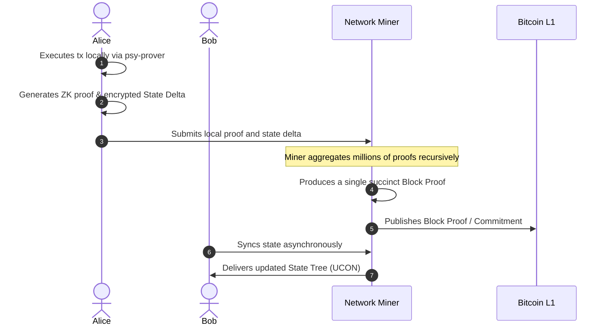

## Project Overview & Background

Psy Protocol (formerly known as QED Protocol) is a trustless, horizontally scalable Layer-1 blockchain and ZK-rollup network<sup>1, 2</sup>. Founded by Carter Jack Feldman, the project has secured substantial backing from prominent venture capital firms including Blockchain Capital, Arrington Capital, StarkWare, and Anagram<sup>1, 3</sup>. Its core mission is to enable internet-scale throughput for Web3 applications (such as high-frequency orderbook exchanges and agentic AI payments) while inheriting the base-layer security of Proof-of-Work networks like Bitcoin and Dogecoin<sup>2, 4, 5</sup>.

<!--more-->

## 1. psy_vm: A Domain-Specific zkVM

Unlike general-purpose zero-knowledge virtual machines (zkVMs) like RISC Zero or SP1, which emulate standard CPU architectures (like RISC-V) to run Rust or C++ code, psy_vm abandons general-purpose emulation entirely<sup>4, 6</sup>.

* **High-Level Language Support:** The psy-compiler natively supports JavaScript, TypeScript, Python, and a custom Psy Domain-Specific Language (DSL)<sup>4, 7</sup>.
* **Direct Constraint Generation:** Instead of compiling these languages into standard machine instructions (opcodes), the compiler translates them directly into highly optimized mathematical logic circuits and constraints<sup>7, 8</sup>.
* **The Goldilocks Field vs. Baby Bear:** While systems like RISC Zero utilize the Baby Bear field and rely heavily on server-side or cloud-based GPU/FPGA proof generation, psy_vm's cryptographic backend (Plonky2) operates strictly over the 64-bit Goldilocks prime field ($p = 2^{64} - 2^{32} + 1$)<sup>4, 8, 9</sup>. Because this field perfectly fits standard 64-bit CPU registers, it enables client-side local proving with minimal latency directly on consumer devices (like mobile phones or browsers)<sup>6, 9</sup>.

### Code Example: Software Defined Circuits (SDC)

Below is a conceptual example of how developer code written in JavaScript/TypeScript is translated into Software Defined Circuits (SDC) by the compiler. It defines mathematical constraints directly without CPU opcode emulation:

```typescript
import { Circuit, Field, Assert } from "@psy-protocol/sdk";

// Define a circuit directly using mathematical constraints
export const TransferCircuit = Circuit((aliceBalance: Field, amount: Field) => {
    // Generate mathematical constraint: Alice must have enough funds
    const remainingBalance = aliceBalance.sub(amount);
    
    // Assert that the remaining balance is greater than or equal to 0
    Assert.greaterThanOrEqual(remainingBalance, Field(0));

    // The output is compiled directly to Plonky2 constraints over the Goldilocks Field
    return remainingBalance;
});
```

To compile this code, developers run the `psy-compiler`:
```bash
psy-compiler compile --input ./transfer.ts --output ./build/circuit.json
```

---

## 2. The PARTH State Model (Parallel Trading)

Psy Protocol circumvents the "sequential processing prison" of traditional blockchains (like Ethereum) via its PARTH (Parallel Arithmetic Recursive Turing-complete Hybrid) state model<sup>10, 11</sup>.

* **Elimination of Global State Contention:** Traditional chains force all transactions to wait in a single line to update a global ledger. In PARTH, every user maintains their own individualized local state tree (UCON)<sup>10</sup>.
* **Local Execution & Encrypted Deltas:** When Alice transacts with Bob, her transaction executes locally on her device via the psy-prover<sup>10</sup>. The client generates a zero-knowledge execution trace and an encrypted "state delta" proving the balance transfer<sup>10</sup>.
* **Asynchronous Global Aggregation:** These local state deltas are sent to network miners. The network uses "Proof of Useful Work" to recursively compress millions of these local zero-knowledge proofs in parallel into a single, succinct block proof<sup>7, 11</sup>. This updates a global Merkle Root, and Bob's personal tree is updated passively and asynchronously the next time he syncs with the network, completely avoiding execution bottlenecks.

### Step-by-Step Transaction Walkthrough



---

## 3. Bitcoin L1 Verification & BitVM Architecture

While Psy operates locally at massive scale, it uses Bitcoin's Layer-1 for settlement security—specifically targeting withdrawal transactions that move assets from the L2 rollup back to Bitcoin<sup>2</sup>.

* **BitVM Principles:** Because Bitcoin Core lacks native opcodes to verify Plonky2 ZK proofs, Psy translates its verification logic into massive logic circuits built from primitive Bitcoin Script opcodes, inspired by BitVM<sup>12</sup>.
* **1,000 UTXO Sharding:** Since a complete ZK verifier script is too large (e.g., 20MB) to fit into a 4MB Bitcoin block, the protocol distributes the logic circuit across approximately 1,000 Unspent Transaction Outputs (UTXOs)<sup>12, 13</sup>. Using Taproot, these scripts are efficiently committed to the blockchain, allowing Psy to achieve direct cryptographic verification on Bitcoin L1 without requiring any network hard forks<sup>12</sup>.

### Challenge-Response Verification Architecture

To verify a Plonky2 proof on Bitcoin without changing the protocol, a BitVM challenge-response mechanism is used. The logic is sharded across UTXOs structured as a binary search tree:

```
                  [Root UTXO: Commitment]
                         /      \
               [UTXO Left]      [UTXO Right]
                 /     \          /     \
               ...     ...      ...     ...
            [Leaf 1] [Leaf 2] [Leaf 3] [Leaf 4] (Primitive operations in Bitcoin Script)
```

1. **Assertion:** The operator asserts the proof by locking collaterals on the Root UTXO.
2. **Challenge:** If a validator detects a false assertion, they challenge it on-chain by spending a specific child UTXO, forcing the operator to reveal intermediate states.
3. **Resolution:** Through a binary search game (taking $O(\log N)$ transactions), the dispute resolves on a leaf transaction that executes a tiny snippet of Bitcoin Script. If the operator fails the check, their collateral is slashed.

---

## 4. Cross-Chain Expansions: Dogecoin & Solana

Psy Protocol is heavily involved in expanding its infrastructure beyond Bitcoin:

* **Dogecoin Scaling:** Psy partnered with Nexus to launch a zkVM on Dogecoin. This involves a proposed new operation code, `OP_CHECKGROTH16VERIFY`, which would allow Dogecoin to natively verify Groth16 proofs, paving the way for Dogecoin-native smart contracts, DEXs, and NFTs<sup>5, 14, 15</sup>.
* **Trustless Bridging:** The protocol has open-sourced infrastructures like `psy-doge-solana-bridge` and `doge-on-solana`, which run full Dogecoin consensus verification within the Solana execution environment. This enables trust-minimized, zero-knowledge bridges that do not rely on centralized multi-sig wallets<sup>16, 17</sup>.

### Bridge Smart Contract Tutorial (Solana Side)

Here is a simplified Rust snippet showing how the Solana program verifies a Dogecoin block header locally to implement a trustless bridge:

```rust
use anchor_lang::prelude::*;

declare_id!("DogeBridgeSolana1111111111111111111111111");

#[program]
pub mod doge_bridge {
    use super::*;

    pub fn verify_doge_block(ctx: Context<VerifyDogeBlock>, header: DogeHeader) -> Result<()> {
        // 1. Calculate difficulty target and verify PoW hash
        let hash = header.calculate_hash();
        require!(hash <= header.target, BridgeError::InvalidProofOfWork);

        // 2. Update the verified tip of the Dogecoin chain state on Solana
        let bridge_state = &mut ctx.accounts.bridge_state;
        bridge_state.tip_height = header.height;
        bridge_state.tip_hash = hash;

        Ok(())
    }
}

#[derive(AnchorSerialize, AnchorDeserialize, Clone)]
pub struct DogeHeader {
    pub version: i32,
    pub prev_block_hash: [u8; 32],
    pub merkle_root: [u8; 32],
    pub time: u32,
    pub bits: u32,
    pub nonce: u32,
    pub height: u64,
    pub target: [u8; 32],
}

#[derive(Accounts)]
pub struct VerifyDogeBlock<'info> {
    #[account(mut)]
    pub bridge_state: Account<'info, BridgeState>,
    pub signer: Signer<'info>,
}

#[account]
pub struct BridgeState {
    pub tip_height: u64,
    pub tip_hash: [u8; 32],
}

#[error_code]
pub enum BridgeError {
    #[msg("Proof of Work hash is invalid or doesn't meet the target difficulty.")]
    InvalidProofOfWork,
}
```

---

## 5. Developer Ecosystem Status

* **Open Source Stack:** The core infrastructure, including `psy-compiler`, `psy-prover` (Rust), and `psy-sdk` (TypeScript), is completely open-source<sup>4, 7</sup>. The repositories reveal support for advanced concepts like Software Defined Circuits (SDC).
* **Tutorials & IDE:** Currently, official developer guides (such as "Smart Contract 0-to-1") and the planned Dapen Browser IDE (which will allow in-browser compiling and debugging) are listed as "Coming Soon" by the team. Web3 developers looking to build immediately must rely on exploring the raw GitHub repositories until the official SDK documentation goes live.
