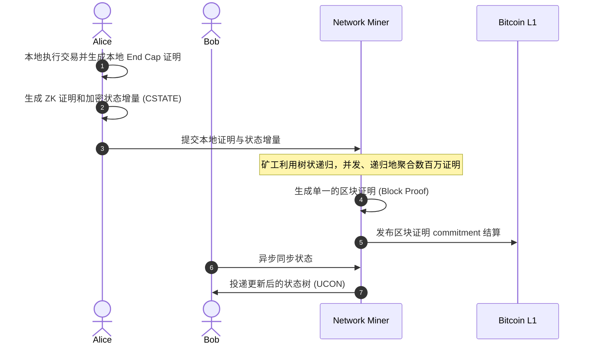

## 项目概述与背景

Psy Protocol（前身为 QED Protocol）是一个无需信任、可水平扩展的 Layer-1 区块链和 ZK-Rollup 网络<sup>1, 2</sup>。其核心使命是打破传统区块链的“串行处理监狱”，通过重新定义状态存储方式和计算发生地，为高频订单簿 DEX、全链游戏 and AI 代理经济等高并发 Web3 应用提供互联网级的吞吐量（TPS），同时继承比特币和狗狗币等 PoW 基础层的安全性<sup>2, 4, 5</sup>。

<!--more-->

## 1. 打破扩展性困境：ZK + PARTH 架构

传统区块链面临三大扩展性困境：TPS与去中心化安全的负相关、全局状态下的串行执行与竞态条件（Race Conditions）、以及多 Rollup 导致的流动性碎片化。Psy Protocol 通过结合零知识证明（ZK）与 PARTH（并行递增递归树层级）模型彻底解决这些问题<sup>10, 11</sup>。

* **写入分离（Write Separation）：** 传统链强制所有交易排队更新同一个全局账本。PARTH 彻底抛弃了全局状态，为每个用户分配专属的本地状态树（UCON）<sup>10</sup>。用户交互时会生成专门的状态切片（CSTATE）。由于交易只更新独立的本地树，完全消除了全局状态争夺和读写冲突，实现了真正的无限并发。
* **软件定义密钥（SDKEY）：** 用户的公钥不再是单纯的密码学私钥推导，而是作为一个 ZK 逻辑电路的哈希值存在，从而在底层实现了原生账户抽象和智能签名。

### PARTH 状态下的并行 Token 转移机制

在典型网络中，Token 余额由全局映射（如 `address => balance`）管理。并发交易会导致写热点冲突，从而被迫串行化。PARTH 通过以下机制实现并发：
1. 每个用户的本地状态树独立维护 Token 余额。
2. 本地状态包含两个映射：`claimedFrom[sender]`（从发送者领取的 Token）和 `sentTo[recipient]`（向接收者发送的 Token）。
3. **发送方（Alice 向 Bob 转账）：** Alice 在**自己的**状态树中减少余额并增加 `sentTo[Bob]`，这是一个完全隔离的本地写入，无锁且无需并发等待。
4. **接收方（Bob 领取余额）：** Bob 在后续区块中通过提交 Alice 状态树更新的 Merkle 证明，更新**自己的**状态树并增加 `claimedFrom[Alice]` 与自身余额。

---

## 2. 计算下放与硬件分工：用户级 vs 矿工级

Psy Protocol 的核心范式转变在于：将繁重且容易引起冲突的“交易执行”下放到用户设备，将高度可并行的“数学验证”交给矿工网络。

* **用户级硬件（Client-Side Proving）：** 终端用户只需使用普通手机或浏览器插件（如 Psy Wallet），通过 `psy_vm` 和高度契合 64 位 CPU 寄存器的 Goldilocks 域，在本地执行智能合约<sup>6, 9</sup>。这不仅实现了零成本的极低延迟，还因为敏感数据不离本地，提供了绝对的原生隐私。用户执行后，生成零知识 execution trace 和“加密状态增量”<sup>10</sup>。
* **矿工级硬件（有用工作量证明 PoUW 2.0）：** 矿工不再计算无意义的随机哈希，而是投入高性能硬件（CPU/GPU/ASIC），负责接收数百万用户的本地证明，并对这些证明进行数学验证和聚合<sup>7, 11</sup>。

### 软件定义电路（SDC）代码示例

以下是开发者使用 TypeScript 编写的智能合约代码，通过编译器直接被翻译为软件定义电路（SDC），而无需任何 CPU 指令集模拟：

```typescript
import { Circuit, Field, Assert } from "@psy-protocol/sdk";

// 直接使用数学约束定义电路
export const TransferCircuit = Circuit((aliceBalance: Field, amount: Field) => {
    // 生成数学约束：Alice 余额必须充足
    const remainingBalance = aliceBalance.sub(amount);
    
    // 断言剩余余额大于或等于 0
    Assert.greaterThanOrEqual(remainingBalance, Field(0));

    // 编译结果将直接映射为 Goldilocks 域上的 Plonky2 约束关系
    return remainingBalance;
});
```

编译命令：
```bash
psy-compiler compile --input ./transfer.ts --output ./build/circuit.json
```

---

## 3. 树状递归与克服“短板效应”

为了将数百万个独立的本地证明同步 to 网络，Psy 采用了**树状递归（Tree Recursion）**机制。这非但没有成为性能瓶颈，反而是实现百万级 TPS 的关键。

### 对数级出块时间与 TPS 估算

矿工将证明两两合并，生成包含之前所有计算的新证明。出块时间计算公式如下：

$$\text{Block Time}(u) = \log_2(u) * (k_r + k_{net})$$

* $k_r$（递归证明合并时间）：合并两个 ZK 证明的计算开销（约 $250\text{ms}$）。
* $k_{net}$（证明传输网络延迟）：证明数据包（约 $30\text{KB}$）在节点间的传输延迟（约 $100\text{ms}$）。

处理 $u$ 个用户的高并发任务时间复杂度降至 $O(\log_2(u))$，理论上仅需不到 10 秒。系统整体 TPS 估算为：

$$\text{TPS}(u) = \frac{t_{max} * u}{\text{Block Time}(u)} = \frac{3u}{0.9 + \log_2(u) * 0.35}$$

其中 $t_{max}$ 表示每个用户的平均交易笔数（保守设为 3）。系统的吞吐量随着并发用户数 $u$ 的增加呈水平线性扩展。

### 解决“短板效应”（Straggler Problem）

在传统分布式架构中，最慢的节点会拖慢全网速度。但在 Psy 的 PoUW 2.0 中，聚合任务的分发是一个开放的算力竞争市场。多个矿工可以同时竞争处理同一个聚合分支，谁最先算出正确结果并生成上一层 ZK 证明，谁就获得奖励。因此，系统的吞吐量由网络整体的算力储备和最高效的节点决定，最慢的矿工只会被淘汰，从而实现了完美的水平并行扩展（Horizontal Scalability）。

### 交易证明聚合流程 (User Proving Session)



---

## 4. 横向架构对比

Psy Protocol 的设计理念与当前主流网络截然不同：

| 特性维度 | Psy Protocol | Solana | Polkadot | Zcash |
| :--- | :--- | :--- | :--- | :--- |
| **状态模型** | 写入分离 (PARTH) / 独立本地状态树 (UCON) | 单一全局账本 | 异构分片多状态树 (Parachains) | 单一全局账本 |
| **计算发生地** | 客户端本地 (链下执行) | 验证者链上执行 | 平行链验证者链上重执行 | 验证者链上执行 |
| **并行验证方式** | 矿工并行 ZK 递归验证 | 验证者流水线串行/并发执行 | 子集验证者重执行区块验证 | 全局验证者全节点验证 |
| **ZK 应用目的** | 压缩海量并发计算，吞吐扩展 (隐私为副产品) | 无原生 ZK (主要用于外部 Rollup 验证) | 无原生 ZK (用以太坊桥时可能间接使用) | 屏蔽发送/接收方及金额，实现纯隐私 |

---

## 5. 比特币 L1 验证与跨链扩展

Psy 在利用高性能并发处理 L2 业务的同时，通过极其创新的机制继承了比特币的绝对安全性：

* **1,000 UTXO 分片验证（BitVM 架构）：** 由于一个完整的 ZK 验证器脚本（约 20MB）无法塞入比特币 4MB 的区块中<sup>12, 13</sup>。协议将逻辑电路拆分到约 1,000 个 UTXO 中。利用 Taproot（P2TR）和 MAST（默克尔抽象语法树）的特性，只需在发生争议或处理提款（Withdrawals）时揭示特定的脚本分支，从而在不分叉比特币的前提下实现原生 ZK 验证<sup>12</sup>。
* **狗狗币扩展：** 协议正与 Nexus 合作开发 Dogecoin zkVM，推动 `OP_CHECKGROTH16VERIFY` 操作码提案以原生验证 Groth16 证明，并已开源如 `doge-on-solana` 等无需信任的零知识跨链桥组件<sup>5, 14, 15, 16, 17</sup>。

### 跨链桥智能合约示例 (Solana 端)

以下 Rust 代码展示了 Solana 智能合约如何通过计算 PoW 难度并校验哈希来本地验证 Dogecoin 区块头：

```rust
use anchor_lang::prelude::*;

declare_id!("DogeBridgeSolana1111111111111111111111111");

#[program]
pub mod doge_bridge {
    use super::*;

    pub fn verify_doge_block(ctx: Context<VerifyDogeBlock>, header: DogeHeader) -> Result<()> {
        // 1. 计算 PoW 难度哈希并进行校验
        let hash = header.calculate_hash();
        require!(hash <= header.target, BridgeError::InvalidProofOfWork);

        // 2. 更新 Solana 链上记录的最新 Dogecoin 状态
        let bridge_state = &mut ctx.accounts.bridge_state;
        bridge_state.tip_height = header.height;
        bridge_state.tip_hash = hash;

        Ok(())
    }
}

#[derive(AnchorSerialize, AnchorDeserialize, Clone)]
pub struct DogeHeader {
    pub version: i32,
    pub prev_block_hash: [u8; 32],
    pub merkle_root: [u8; 32],
    pub time: u32,
    pub bits: u32,
    pub nonce: u32,
    pub height: u64,
    pub target: [u8; 32],
}

#[derive(Accounts)]
pub struct VerifyDogeBlock<'info> {
    #[account(mut)]
    pub bridge_state: Account<'info, BridgeState>,
    pub signer: Signer<'info>,
}

#[account]
pub struct BridgeState {
    pub tip_height: u64,
    pub tip_hash: [u8; 32],
}

#[error_code]
pub enum BridgeError {
    #[msg("Proof of Work hash is invalid or doesn't meet the target difficulty.")]
    InvalidProofOfWork,
}
```

### 生产环境跨链桥的工程约束

上述合约仅为基础逻辑骨架，在生产环境中，一个无需信任的 Dogecoin 桥必须解决以下约束：
1. **Solana 上的 Scrypt 算力限制**：Dogecoin 采用 Scrypt 算法。在 Solana 上直接计算 Scrypt 会消耗海量 Compute Unit (CU)，极易超出单笔交易的 CU 上限。生产级实现会要求算力节点在链下计算 Scrypt 并生成 ZK 证明，Solana 合约仅验证 ZK 证明。
2. **区块分叉与重组**：为应对分叉，合约必须在链上记录区块的 DAG（有向无环图）路径，并在区块达到一定确认数（如 6 个确认）后才触发解锁。
3. **科学记数法目标解析**：区块头中的难度目标通过 32 位 `bits` 的 compact 格式存储，合约必须在链上将其还原为 256 位无符号整数才能与 hash 进行大小对比。
4. **DigiShield 难度动态计算**：Dogecoin 采用 DigiShield 逐块调整难度。合约必须在链上计算历史区块的时间戳间隔以校验 `target` 的合法性，防御恶意节点提交伪造低难度区块的攻击。

---

## 6. 开发者生态与现状

* **多语言支持：** `psy-compiler` 面向 Web2 开发者，原生支持将 JavaScript、TypeScript 和 Python 直接编译为 ZK 逻辑电路约束，无需传统的虚拟机操作码。
* **进展：** 核心组件（`psy-compiler`, `psy-prover`, `psy-sdk`）已在 GitHub 开源。目前针对大众开发者的教程和在浏览器内运行的 Dapen IDE 仍在“即将推出（Coming Soon）”状态，想要抢先体验的开发者需直接查阅开源代码库。

---

## 核心参考资料

1. **QED Protocol Blog:** *ZK + PARTH: An Architecture for Building Horizontally Scalable Blockchains*
2. **BitVM 架构解析:** *BitVM 2: Permissionless Verification on Bitcoin*
3. **Psy Protocol GitHub:** [github.com/psyprotocol](https://github.com/psyprotocol)
4. **相关新闻:** *CryptoBriefing / Business Wire (关于狗狗币 zkVM 与千万美元融资报道)*
