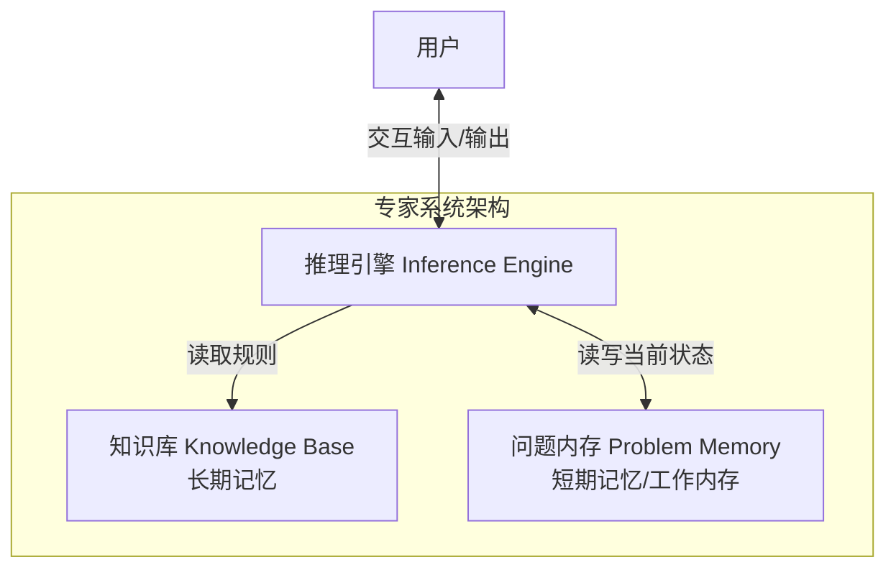

本篇笔记基于微软 [AI-For-Beginners](https://github.com/microsoft/AI-For-Beginners) 课程的第二章：**符号人工智能 (Symbolic AI)** 进行整理，详细记录了符号 AI 与专家系统、知识表示、推理方法（前向与后向推理）以及本体与语义网的相关概念与核心架构。

<!--more-->

## 一、 知识与信息/数据的区别

在符号 AI（Top-down 自上而下方法）中，核心思想是将人类知识转化为机器可读的形式，以此来解决问题。

### 1. DIKW 金字塔模型
为了定义什么是“知识”，通常使用 **DIKW 金字塔** 来对相关概念进行分层：

*   **数据 (Data)**：存在于物理介质（如书本、网页）中的符号、文字或声音。它独立于人类而存在，并可在人与人之间传递。
*   **信息 (Information)**：人类大脑对数据的解读与理解。
*   **知识 (Knowledge)**：将信息整合进人类个体的主动世界模型中。它通过主动的**学习过程**获得，形成一个互相关联的概念网络。
*   **智慧 (Wisdom)**：更高层级的理解，代表“元知识 (Meta-knowledge)”，即关于如何以及何时使用这些知识的认知。

---

## 二、 计算机知识表示 (Knowledge Representation)

知识表示的目标是寻找一种有效的方法，将知识以**数据**的形式存储在计算机中，使其能够被自动利用。知识表示方法存在一个光谱：

*   **左端（简单/算法化）**：如直接用程序代码表示，灵活性极低，但计算机极易处理。
*   **右端（自然语言文本）**：表达能力最强，但计算机很难直接对其进行自动推理。

### 知识表示的分类

#### 1. 网络表示法 (Network Representations)
*   **语义网络 (Semantic Network)**：将大脑中相互关联的概念用图形（图结构）在计算机中进行复现。
*   **对象-属性-值三元组 (Object-Attribute-Value triplets, OAV)**：图在计算机中可表示为节点和边，因此可通过三元组列表构建语义网络。
    *   *示例*：
        *   `Python` - `is` - `Untyped-Language`
        *   `Python` - `invented-by` - `Guido van Rossum`

#### 2. 层次表示法 (Hierarchical Representations)
*   **框架表示法 (Frame Representation)**：模仿人类对事物的分类。将每个对象或类表示为一个**框架 (Frame)**，其中包含多个**槽 (Slot)**。
    *   槽可以拥有默认值、取值限制或在获取值时触发的存储过程（类似于面向对象编程中的类与属性）。
*   **场景 (Scenarios)**：一种特殊的框架，用于表示随时间展开的复杂情境。

#### 3. 过程表示法 (Procedural Representations)
*   **产生式规则 (Production Rules)**：使用 `IF-THEN` 语句来表达逻辑因果关系。
    *   *示例*：`IF 动物吃肉 OR (有锋利牙齿 AND 有爪子 AND 双眼向前) THEN 该动物是肉食动物`。
*   **算法 (Algorithms)**：虽然是过程表示，但在知识库系统中很少直接使用。

#### 4. 逻辑表示法 (Logic)
*   **谓词逻辑 (Predicate Logic)**：过于复杂以至于难以完全计算，因此通常使用其子集（如 Prolog 中使用的 Horn 子句）。
*   **描述逻辑 (Description Logic, DL)**：用于表示和推理对象层次结构，是语义网 (Semantic Web) 的理论基石。

---

## 三、 专家系统 (Expert Systems)

**专家系统**是符号 AI 早期最成功的应用之一，旨在特定受限领域中扮演人类专家的角色。

### 1. 系统架构
专家系统的结构模拟了人类的神经与推理系统：

*   **知识库 (Knowledge Base)**：保存从人类专家处提取的长期知识（相当于长期记忆）。
*   **问题内存 (Problem Memory)**：保存当前正在解决的具体问题的数据与状态（相当于短期记忆/工作内存）。
*   **推理引擎 (Inference Engine)**：在问题内存和知识库之上执行推理。



### 2. 推理方式

#### 前向推理 (Forward Inference)
从已知的数据出发，主动推导结论。
1.  **冲突集合**：寻找所有当前条件被满足的规则。
2.  **冲突解决**：采用特定策略选择一条规则执行（如：选第一条、随机选、或选择条件最具体的规则）。
3.  **应用规则**：执行规则，将推导出的新事实（三元组）存入工作内存。
4.  **循环**：重复上述步骤，直至得到目标属性。

#### 后向推理 (Backward Inference)
由目标（Hypothesis/Goal）驱动，逆向寻找证据。
1.  **确定目标**：寻找能够得出该目标的规则。
2.  **验证条件**：如果规则的左侧（条件部分）未知，则将这些条件作为“子目标”进行递归证明。
3.  **询问用户**：如果某个属性无法通过规则推导且无其他方法，则向用户提问获取。
4.  **回溯**：若当前假设证明失败，则尝试其他候选规则。

> **可解释性**是知识型专家系统的重要特点：系统做出的每一项决策，都可以通过其推理链路（应用了哪些规则）被清晰地解释。

---

## 四、 本体与语义网 (Ontologies & Semantic Web)

### 1. 语义网技术栈
在20世纪末，人们尝试用知识表示技术对互联网资源进行标注，以实现精准检索。
*   基于**描述逻辑 (DL)** 提供严密的逻辑语义。
*   使用全局 **URI** 标识概念，支持跨越互联网的分布式知识表示。
*   采用 XML 语言家族：**RDF**、**RDFS**、**OWL (Web Ontology Language)**。

### 2. 本体 (Ontology)
本体是对某一问题域的**显式规格说明**。最简单的本体是概念分类法，复杂的本体则包含推理规则。
*   **三元组**是语义网的核心。例如，用三元组表示“AI课程由Dmitry于2022年开发”：
    *   `课程链接` - `creator` - `作者主页`
    *   `课程链接` - `creation-date` - `"Jan 1, 2022"`

### 3. 代表性项目
*   **WikiData**：从维基百科信息框 (InfoBoxes) 中提取的机器可读知识库，支持使用 **SPARQL** 语言进行复杂查询。
*   **DBpedia**：与 WikiData 类似的维基百科知识提取项目。
*   **Protégé**：斯坦福大学开发的优秀可视化本体编辑器。

### 4. 实践案例：家族本体推理 (Family Ontology Inference)
在 [FamilyOntology.ipynb](https://github.com/microsoft/AI-For-Beginners/blob/main/lessons/2-Symbolic/FamilyOntology.ipynb) 中，展示了如何使用语义网技术来自动化推理家族关系：
*   **家谱数据源**：使用 `python-gedcom` 库读取 Romanov 皇室家族的 GEDCOM 格式数据文件 (`data/tsars.ged`)。
*   **本体定义 (onto.ttl)**：通过 Turtle 格式定义了亲属关系规则。基础关系包括 `isFatherOf`, `isMotherOf`, `isBrotherOf`, `isSisterOf`，更高级的亲属关系通过推理链规则定义。
    *   例如，**阿姨**的定义是：*父母的姐妹*。在 OWL 中以链式公理（`propertyChainAxiom`）表达：
        ```turtle
        fhkb:isAuntOf a owl:ObjectProperty ;
            rdfs:domain fhkb:Woman ;
            rdfs:range fhkb:Person ;
            owl:propertyChainAxiom ( fhkb:isSisterOf fhkb:isParentOf ) .
        ```
*   **推理引擎与闭包生成**：
    1. 脚本遍历 GEDCOM 文件，提取各成员的性别与亲缘关系，转换成对应的 RDF 三元组并追加到本体文件中。
    2. 使用 `rdflib` 读取本体图。
    3. 引入推理库 `owlrl`，调用 `DeductiveClosure(OWLRL_Extension).expand(g)` 计算逻辑闭包（Closure），自动生成所有能间接推导出的隐含关系。
*   **关系查询**：基于推理后扩展的三元组图，使用 **SPARQL** 语言进行语义查询（如：`SELECT ?aname ?bname WHERE { ?a fhkb:isUncleOf ?b ... }`），可直接获取家谱中所有“叔叔/舅舅”关系的关联对，无需手动编写复杂的条件搜索代码。

---

## 五、 概念图与主题分类 (Concept Graph & Theme Classification)

*   **自动构建**：与人工构建的本体不同，它是通过**挖掘 (mining)** 自然语言等非结构化文本自动生成的。
*   **概率性 `is-a` 关系**：例如 "Microsoft" 是 "company" 的概率为 0.87，是 "brand" 的概率为 0.75。这为机器理解人类概念提供了概率模型。

### 1. 实践案例：利用概念图进行新闻主题分类
在 [MSConceptGraph.ipynb](https://github.com/microsoft/AI-For-Beginners/blob/main/lessons/2-Symbolic/MSConceptGraph.ipynb) 中，展示了概念图在自然语言主题分类中的实际应用：
*   **API 替代说明**：由于原 Microsoft Concept Graph API 已下线，该示例现已切换为使用 **ConceptNet** (conceptnet.io) 的 REST API 接口。ConceptNet 拥有超 800 万个节点、2100 万条边，是一个包含 `IsA` (是一个), `PartOf` (一部分), `UsedFor` (用于) 等多种关系的多语言开源语义网。
*   **应用流程**：
    1.  **获取新闻标题**：调用 `NewsApi.org` 接口，拉取最新的英美头条新闻标题。
    2.  **名词提取 (NLP)**：使用 `TextBlob` 库对新闻标题进行分析，提取出所有的名词短语 (Noun Phrases)。
    3.  **概念泛化 (Abstraction)**：直接根据名词短语进行分类会导致类别过于分散。因此，程序循环每个提取出的名词短语，通过 ConceptNet 的 `IsA` 接口查询其上级概念（例如，输入某个特定公司或产品名称，返回 `company`, `person`, `nation`, `economy` 等父类概念及其归一化权重）。
    4.  **聚合分类**：若泛化父概念的权重超过阈值 (0.1)，便将该新闻归类到对应的 `ECONOMY`（经济）、`NATION`（国家）、`PERSON`（人物）等核心主题下。
*   **核心价值**：这种分类方式**不需要任何有监督的标注数据**（即不需要训练分类器），完全依赖现有的常识知识图谱，实现了对未知新闻标题的合理主题聚合，体现了符号 AI（知识驱动型）在概念抽象与语义泛化上的独特能力。

## 六、 总结与展望

在深度学习和神经网络大行其道的今天，符号 AI 的**显式推理 (Explicit Reasoning)** 依然不可或缺：
1.  神经网络通常难以提供决策的**可解释性**，而符号 AI 可以清晰回溯。
2.  在需要受控地修改系统行为、或者必须保证100%符合逻辑约束的实际项目中，知识库和推理机依然发挥着关键作用。
